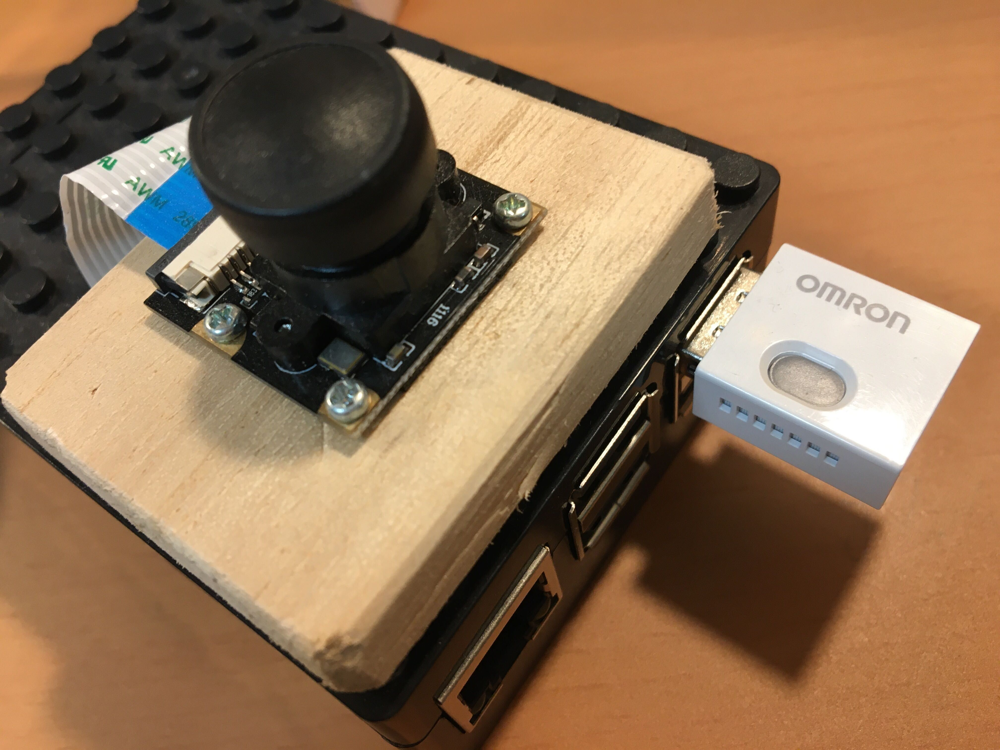

# 【行動識別班】Raspiと連携した保育の質自動評価API作成の活動報告

## 前回記事
**画像回転は乳児識別精度向上に貢献するか？**
https://hoikutech.com/blog/yolox-rotate-test/

## 概要
行動識別班では保育と技術の融合として、保育の質を定量的に測ることができるAPIの作成を行う。
保育の質の評価軸として主に国外で使用されるITERS-3™を参照し、Raspiカメラやオムロンセンサーなどを用いて機械のみで映像や現場の環境の状況を評価することで以下のメリット・デメリットが見込まれる。

### メリット
- 公平に定量的に評価することができる
- 第三者の監査人の人件費を削減することができる
- 子供たちに知らない大人がいる威圧感や緊張感を与えなくて済む
- Raspiやその他のセンサー類があれば容易に導入することができる
（ローカルネットワークなどの知識が必要となるがそれはドキュメントなどで補いたい）

### デメリット
- あくまで機械的に判断するので臨機応変な対応は難しい
（実地調査などで環境ごとの初期値などを考慮する必要がある）
- センサーで得られる情報に依存するので評価できる項目が限られる
- 一部のセンサー値（騒音レベル）の信用性が低く正確な評価ができない可能性がある

## メンバーの役割分担（一名ずつ）
- 写真の物体検出（物体検出、Yolox等）
- 物体検出の結果やオムロンセンサーから環境を評価するAPI作成（Raspi, Node）
- API評価結果のGUI（HTMLベース）

## 自動評価APIの機能（現行）
- 物体検出で「子供」「大人」の人数を検出し保育士一人当たりの児童数を取得し評価する
- 騒音レベルの評価
（45デシベル以下が理想）
- 気温レベルの評価
（検討中）

## 今後の予定
#### 【写真の物体検出】
- カメラから取った映像が大人と子供を分けて認識、人数や配置比率を計算する
1. Jetsonで映像を読み込み、物体検出(Yolox)結果のjsonを出力する
↑イマココ
2. 得られたjsonを評価APIにPostして連携

#### 【評価API】
- APIの気温評価基準を実装
↑イマココ
- Raspiでポーリングして毎n秒ごとに得た値を評価する
（物体検出で回転させて調べる場合は時間がかかるため、ポーリングの間隔は５秒前後で検討）
- API側とGUIとの連携
- 新規で評価項目の追加なども含め検討

---
## 作者・著者
岩崎学園 セキュリティゼミ 佐野柊介